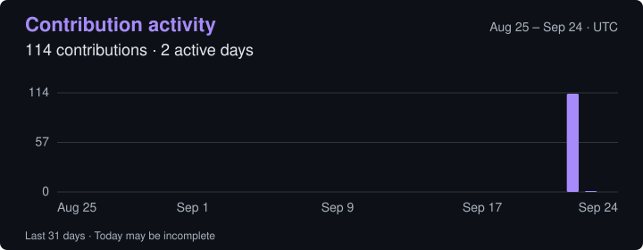

 

 

 

 
 

 
 

---

## About

I am a **Computer Science with AI student at Brunel University London** with a strong focus on **software engineering, AI/ML, full stack development, data systems, and cybersecurity fundamentals**. My work combines technical implementation with product thinking, clean architecture, stakeholder communication, and measurable operational impact.

Alongside my degree, I work at Brunel University London as a **Lead Student Ambassador** and as a **ResLife Ambassador managing Student Living**. My experience spans student recruitment, outreach, healthcare administration, commercial marketing, and full stack development.

My engineering direction is centred on building reliable, scalable, and user-focused software products that combine strong foundations in **algorithms, data structures, databases, networks, security, and modern development workflows**.

 

**Open To**

<pre><code class="language-yaml">roles:
  - Graduate Software Engineer
  - Software Engineering Intern
  - AI / Machine Learning Intern
  - Data Analyst Intern
  - Cybersecurity Intern
  - Business Analyst Intern

interests:
  - Full Stack Development
  - AI / ML Systems
  - Secure Software Engineering
  - Data-Driven Products
  - Cloud & DevOps
  - Open Source Engineering
</code></pre>

---

## Tech Stack

### Languages

 
 

### Frontend

 
 

### Backend & Databases

 
 

### Cloud, DevOps & Tooling

---

## AI / ML Expertise

| Domain                          |  Proficiency | Details                                                                                                                       |
| ------------------------------- | -----------: | ----------------------------------------------------------------------------------------------------------------------------- |
| Machine Learning Foundations    | Intermediate | Studying AI as part of Computer Science with AI, with focus on intelligent systems, model reasoning, and applied ML concepts. |
| Python for AI & Data            | Intermediate | Using Python for software development, automation, data handling, and full stack backend implementation.                      |
| Data Analysis                   | Intermediate | Experience with data entry, data management, database systems, research, reporting, and process optimisation.                 |
| AI Tooling                      |   Developing | Actively building technical skills with AI tools, software workflows, and practical engineering use cases.                    |
| Cybersecurity & Ethical Hacking |   Developing | Self-studying network security, ethical hacking concepts, and CTF-based practical exercises.                                  |
| Product Engineering             |       Strong | Focused on building usable, scalable, and maintainable systems with clear business and user value.                            |

---

## Featured Projects

<b>Raez — Warehouse & Logistics Management Platform</b>

 

A full-stack logistics and warehouse management platform designed to support inventory tracking, deliveries, order processing, and warehouse operations through a Java-based application backed by SQLite.

| Attribute   | Details                                                                                  |
| ----------- | ---------------------------------------------------------------------------------------- |
| Stack       | Java, SQLite, CSS, Figma, DB Browser for SQLite                                          |
| Scale       | Multi-module group project covering warehouse, delivery, order, and frontend modules     |
| Performance | Real-time stock-level visibility and order fulfilment workflows                          |
| Security    | Database-backed records with structured data validation and controlled operational flows |
| Impact      | Converted a prototype into a complete downloadable application for logistics management  |
| Repository  | Academic Group Project                                                                   |

Built the warehouse management module by translating the team's Figma prototype into a functional Java application. Converted an initial React-style UI concept into a native Java implementation while preserving design consistency across the application rewrite. Debugged integration issues across merged features and validated database behaviour using DB Browser for SQLite.

 

<b>Personal Finance Tracker</b>

 

A full-stack web application for tracking income, expenses, and spending patterns through a clean Flask backend, SQLite database, and interactive JavaScript dashboard.

| Attribute   | Details                                                      |
| ----------- | ------------------------------------------------------------ |
| Stack       | Python, Flask, HTML, CSS, JavaScript, SQLite, Chart.js       |
| Scale       | Personal finance management web application                  |
| Performance | Lightweight backend with responsive dashboard visualisation  |
| Security    | Local database persistence with structured financial records |
| Impact      | Helps users understand income, expenses, and spending trends |
| Repository  | Portfolio Project                                            |

Developed a database-backed financial tracking system using Python and Flask, with SQLite for persistent storage and Chart.js for visual spending insights. The project demonstrates full stack fundamentals across routing, templating, data storage, frontend presentation, and product-focused usability.

 

<b>Cybersecurity & Ethical Hacking Lab</b>

 

An independent self-study track focused on network security, ethical hacking fundamentals, responsible security practice, and CTF-based learning.

| Attribute   | Details                                                                 |
| ----------- | ----------------------------------------------------------------------- |
| Stack       | Linux, Networking, Security Tools, CTF Platforms                        |
| Scale       | Ongoing independent cybersecurity learning pathway                      |
| Performance | Practical security knowledge reinforced through hands-on challenges     |
| Security    | Focused on secure engineering, network defence, and responsible testing |
| Impact      | Strengthens secure engineering mindset alongside formal CS coursework   |
| Repository  | Ongoing Self-Study                                                      |

Completing network security and ethical hacking modules independently while applying concepts through CTF challenges. This work supports a broader engineering goal of writing secure software and understanding how systems fail under real-world attack patterns.

---

## Experience

### Lead Student Ambassador

**Brunel University London** 21 September 2026 – Present

Promoted from Student Ambassador, a role held since **November 2025**.

* Lead campus tours for **50–80 prospective students and families**, answering questions and keeping sessions on schedule.
* Support UCAS Clearing enquiries on courses, entry requirements, and enrolment; maintain accurate applicant records in university CRM systems.
* Support open days, event logistics, and outreach campaigns on campus and social media.

### ResLife Ambassador

**Brunel University London** 13 September 2026 – Present

Manage **Student Living** as a ResLife Ambassador.

### Marketing Intern

**Lahore University of Management Sciences (LUMS)** July–August 2024

* Independently secured a sponsorship partnership and received the **Best Intern Award** across the internship cohort.
* Coordinated with marketing, design, and logistics teams to deliver outreach campaigns within scope and deadline.

### Receptionist Intern

**Shaukat Khanum Memorial Cancer Hospital** July–September 2020

* Maintained patient records and appointment schedules in internal database systems while protecting confidentiality.
* Handled high volumes of inbound enquiries, directed patients to the appropriate departments, and supported reception operations.

---

## Achievements

| Recognition                         | Details                                                                                                                  |
| ----------------------------------- | ------------------------------------------------------------------------------------------------------------------------ |
| **Best Intern Award — LUMS**        | Awarded across the full internship cohort after independently securing a sponsorship partnership.                        |
| **Sponsorship Partnership Secured** | Identified and closed external funding support during marketing internship.                                              |
| **Student Leadership**              | Promoted to Lead Student Ambassador at Brunel University London; also serve as a ResLife Ambassador in Student Living.   |
| **Community Event Operations**      | Coordinated weekly sessions and large-scale events for 100+ attendees as an ISOC Committee Member.                       |
| **Full Stack Project Delivery**     | Built and contributed to database-backed software projects using Java, Python, Flask, SQLite, and frontend technologies. |

---

## Certifications & Learning Paths

### AWS

### Oracle

### NPTEL

### Cisco

---

## GitHub Analytics

 
 

---

## Contribution Activity

<picture>
  <source media="(max-width: 600px)" srcset="./profile/activity-mobile.svg" />
  
</picture>

[View contribution history](https://github.com/furqanfsl?tab=overview) · [Image refresh status](https://github.com/furqanfsl/furqanfsl/actions/workflows/profile-analytics.yml)

---

## Contribution Snake

<picture>
  <source media="(prefers-color-scheme: dark)" srcset="https://raw.githubusercontent.com/furqanfsl/furqanfsl/output/github-contribution-grid-snake-dark.svg" />
  <source media="(prefers-color-scheme: light)" srcset="https://raw.githubusercontent.com/furqanfsl/furqanfsl/output/github-contribution-grid-snake.svg" />
  
</picture>

---

## Current Focus

<pre><code class="language-yaml">Learning:
  - Advanced software engineering principles
  - Algorithms and data structures
  - AI and machine learning systems
  - Networks, security, and ethical hacking
  - Cloud, DevOps, and deployment workflows

Building:
  - Full stack web applications
  - Database-backed software systems
  - AI-assisted developer workflows
  - Secure and scalable engineering projects
  - Open source portfolio projects

Exploring:
  - Applied machine learning
  - Cybersecurity labs and CTF challenges
  - Product engineering
  - Data analytics and automation
  - Enterprise software architecture

Open To:
  - Graduate software engineering roles
  - Software development internships
  - AI / ML internships
  - Data analysis internships
  - Cybersecurity internships
  - Open source collaboration
</code></pre>

---

## Connect

---

**Engineering reliable software, intelligent systems, and secure digital products with purpose, precision, and impact.**

